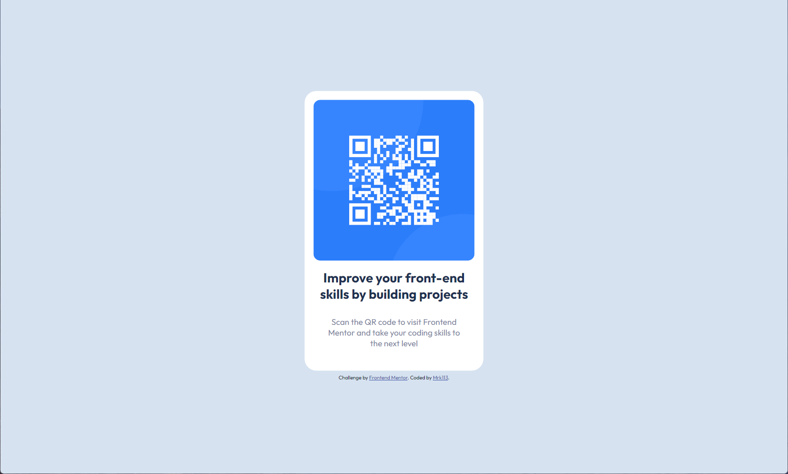

# Frontend Mentor - QR code component solution

This is a solution to the [QR code component challenge on Frontend Mentor](https://www.frontendmentor.io/challenges/qr-code-component-iux_sIO_H). Frontend Mentor challenges help you improve your coding skills by building realistic projects. 

## Table of contents

- [Overview](#overview)
  - [Screenshot](#screenshot)
  - [Links](#links)
- [My process](#my-process)
  - [Built with](#built-with)
  - [What I learned](#what-i-learned)
  - [Useful resources](#useful-resources)
- [Author](#author)

## Overview

### Screenshot



### Links

- Live Site URL: (https://mrk113.github.io/QR-Code-Website/)

## My process

### Built with

- Semantic HTML5 markup
- CSS custom properties
- Flexbox
- Mobile-first workflow

### What I learned

Centering Vertically and Horizontally:

```css
.wrapper {
    margin: 0;
    position: absolute;
    top: 50%;
    left: 50%;
    transform: translate(-50%, -50%);
}
```

### Useful resources

- [Resource 1](https://fonts.google.com/) - This helped me for Fonts.
- [Resource 2](https://www.w3schools.com/howto/howto_css_center-vertical.asp) - This is an amazing article which helped me finally understand Centering Vertically. I'd recommend it to anyone still learning this concept.

## Author

- Frontend Mentor - [@Mrk113](https://www.frontendmentor.io/profile/Mrk113)
